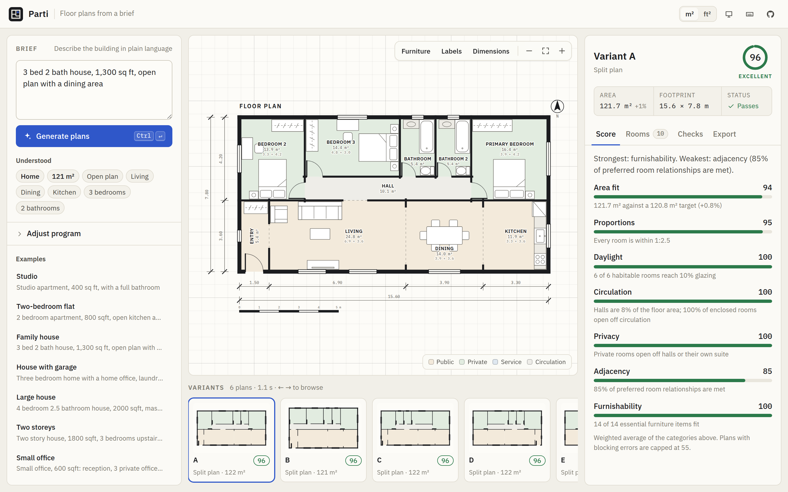
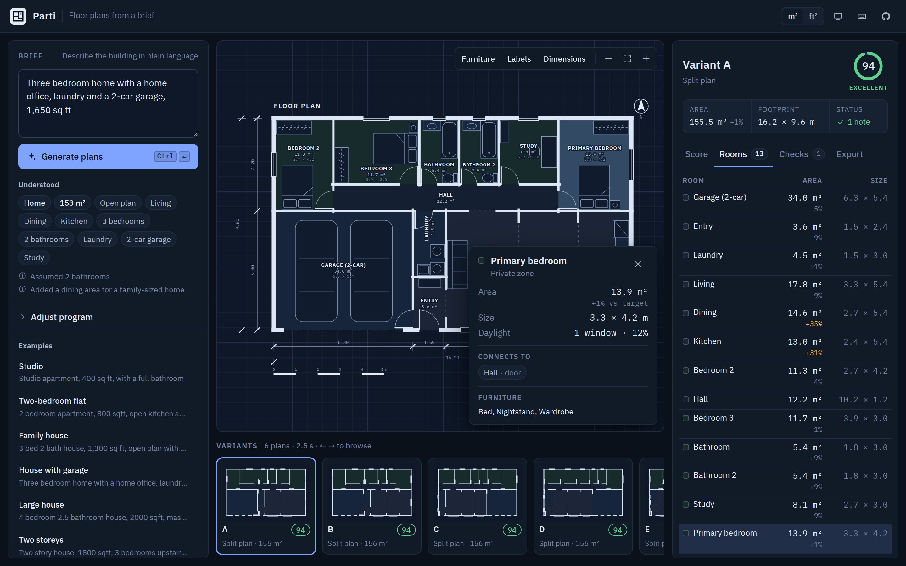
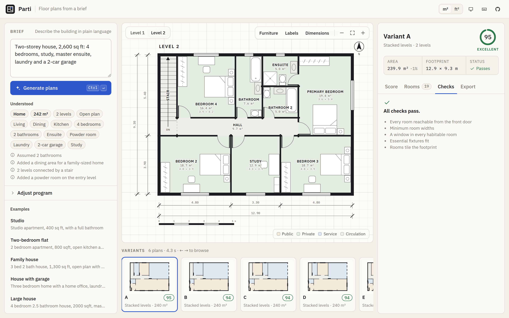
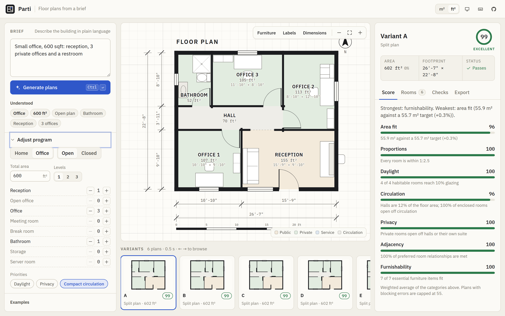
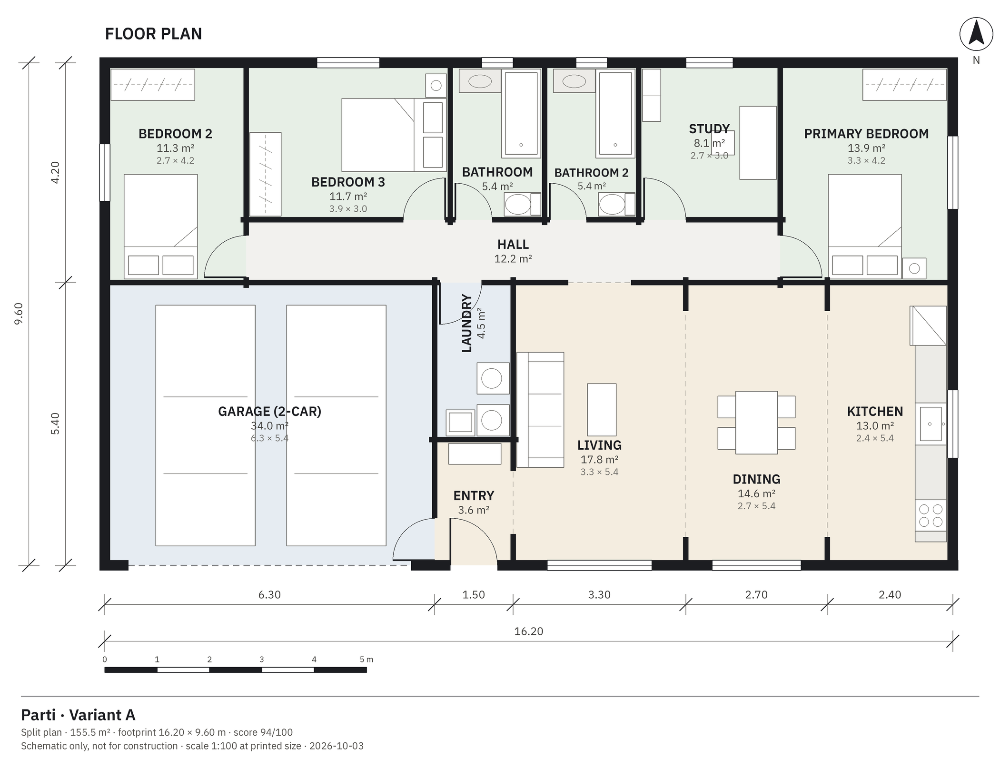
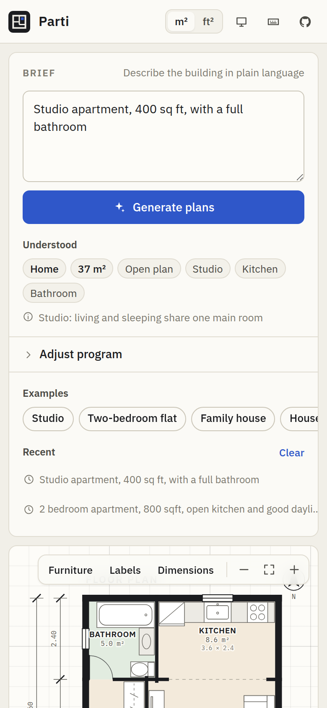
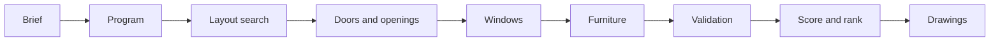

<div align="center">


# Parti

Schematic floor plans from a plain-language brief.

[](https://github.com/H4ch1Net/Parti/actions/workflows/ci.yml)




</div>

Type a brief such as `3 bed 2 bath house, 1,300 sq ft, open plan`. Parti reads it into a room program, searches several hundred layouts, and returns up to six ranked variants. Each variant has walls, doors, windows, furniture, a score breakdown and a list of checks. Plans can be inspected room by room, compared, shared as a link, and exported to PDF, SVG, PNG or DXF.

A *parti* is the organising idea behind an architectural plan. Here it is the arrangement the engine settles on: a split plan with public rooms at the front and bedrooms on a hall, a wing plan, or stacked levels around a stair.

> [!NOTE]
> Output is schematic. It is useful for exploring layouts and areas early on. It is not checked against building codes and is not a construction drawing.

## Features

| | |
|---|---|
| **Brief interpretation** | Digits and number words, `2-bedroom`, `3br/2ba`, half baths, `1,200 sq ft` or `85 m2`, stories, garages, home offices and commercial programs. Every assumption is listed. |
| **Editable program** | Adjust room counts, total area, levels, layout style and priorities before generating. |
| **Exact layouts** | Rooms tile the footprint on a 0.3 m grid with no overlaps or gaps. Multi-level plans share a footprint and a stair that lines up. |
| **Circulation** | Doors and openings are planned from the front door. Bedrooms open off halls, ensuites off their bedroom, and open-plan rooms flow together. |
| **Daylight and furniture** | Windows are sized to a 10% glazing target. Beds, kitchens, bathrooms, desks and cars are placed clear of door swings. |
| **Checks and score** | Blocking errors (unreachable rooms, rooms too narrow, missing windows) are separated from warnings. Seven scored categories each explain themselves. |
| **Interactive canvas** | Pan, zoom and pinch on crisp vectors. Hover and click rooms for details, toggle furniture, labels and dimensions, and switch levels. |
| **Exports** | PDF (A3 at a standard scale), SVG (1:100), PNG, DXF with CAD layers, and JSON. |
| **Sharing** | The URL encodes the brief, and generation is deterministic, so a link reproduces the same plans. |
| **Comfort** | Light and dark (blueprint) themes, metric and imperial units, keyboard shortcuts, recent briefs, and layouts down to phone width. |

## Screenshots

<table>
  <tr>
    <td width="50%"></td>
    <td width="50%"></td>
  </tr>
  <tr>
    <td>Dark theme, room inspector and schedule</td>
    <td>Two-storey house, upper level</td>
  </tr>
  <tr>
    <td></td>
    <td></td>
  </tr>
  <tr>
    <td>Office brief, program editor, imperial units</td>
    <td>PNG export</td>
  </tr>
</table>

<details>
<summary>Mobile layout</summary>
<br />

</details>

## Quick start

### Docker, single image

The API serves the compiled web client on one port.

```bash
docker build -t parti .
docker run --rm -p 8000:8000 parti
```

Open `http://localhost:8000`. API docs are at `http://localhost:8000/docs`.

### Docker Compose, development

```bash
docker compose up --build
```

The web app runs on `http://localhost:5173` with hot reload, and the API on `http://localhost:8000` with auto-reload.

### Local

Requirements: Python 3.11 or newer, Node.js 20.19 or newer.

```bash
make setup   # backend venv + npm install
make dev     # API on :8000 and web app on :5173
```

<details>
<summary>Without make</summary>

```bash
# API
cd backend
python3 -m venv .venv
.venv/bin/pip install -r requirements-dev.txt
.venv/bin/uvicorn app.main:app --reload --port 8000

# Web app, in a second terminal
cd frontend
npm install
npm run dev
```

The Vite dev server proxies `/api` to `http://localhost:8000`.
</details>

## Usage

1. Describe the building in the brief box, or pick an example.
2. Check the **Understood** chips. They show what was read and what was assumed.
3. Optionally open **Adjust program** to change counts, area, levels or priorities.
4. Press **Generate plans** (<kbd>Ctrl</kbd> <kbd>Enter</kbd>).
5. Browse variants, click rooms on the plan, and read the **Score**, **Rooms** and **Checks** tabs.
6. Export from the **Export** tab, or copy the share link.

### Writing briefs

| Write | Understood as |
|---|---|
| `3 bed 2.5 bath` | 3 bedrooms, 2 bathrooms, 1 powder room |
| `two-storey`, `upstairs` | 2 levels with a stair |
| `master ensuite` | Ensuite off the primary bedroom |
| `2-car garage` | Garage sized for two cars |
| `home office`, `study`, `den` | Study (the building stays residential) |
| `1,400 sq ft`, `130 m2` | Target area. If omitted, it is estimated from the rooms. |
| `open plan`, `separate kitchen` | Open or closed kitchen |
| `daylight`, `privacy`, `compact` | Scoring priorities |
| `office for 12 people, 2 meeting rooms` | Reception, open office, meeting rooms, restroom |

If the stated area is too small for the rooms, it is raised to a workable size and a note says so.

### Keyboard shortcuts

| Keys | Action |
|---|---|
| <kbd>Ctrl</kbd>/<kbd>⌘</kbd> <kbd>Enter</kbd> | Generate plans |
| <kbd>←</kbd> <kbd>→</kbd> | Previous or next variant |
| <kbd>1</kbd> <kbd>2</kbd> <kbd>3</kbd> | Switch level |
| <kbd>+</kbd> <kbd>−</kbd> <kbd>0</kbd> | Zoom in, zoom out, fit |
| <kbd>F</kbd> <kbd>L</kbd> <kbd>D</kbd> | Toggle furniture, labels, dimensions |
| <kbd>U</kbd> | Switch m² and ft² |
| <kbd>Esc</kbd> | Clear the room selection |
| <kbd>?</kbd> | Show all shortcuts |

On the canvas: scroll to zoom, drag to pan, double-click to fit.

## Configuration

Copy `.env.example` for reference. All settings are optional.

| Variable | Used by | Default | Purpose |
|---|---|---|---|
| `PARTI_CORS_ORIGINS` | API | `http://localhost:5173,http://127.0.0.1:5173` | Allowed browser origins, comma separated |
| `PARTI_LOG_LEVEL` | API | `INFO` | Log level |
| `PARTI_STATIC_DIR` | API | `frontend/dist` | Built web client to serve at `/` |
| `PARTI_API_URL` | Vite dev server | `http://localhost:8000` | Proxy target for `/api` |
| `VITE_API_BASE` | Web build | empty (same origin) | API origin when it is hosted elsewhere |

## Commands

| Command | Description |
|---|---|
| `make setup` | Install backend and frontend dependencies |
| `make dev` | Run the API and the web app |
| `make test` | Backend pytest suite and frontend Vitest suite |
| `make lint` | Ruff lint and format check, TypeScript typecheck |
| `make build` | Production build of the web app |
| `make smoke` | End-to-end browser test against a running app |
| `make screenshots` | Regenerate `docs/screenshots` from a running app |
| `make docker` | Build and run the single image |

The smoke and screenshot scripts use Playwright. Install a browser once with `npx playwright install chromium`, or point `CHROMIUM_PATH` at an existing Chromium.

## How it works



Plans are slicing trees: each node splits its rectangle along one axis, and each leaf is a room. Sizes are allocated in grid units, proportional to target areas, with minimum dimensions enforced, so the result always tiles the footprint. Templates provide the tree shapes. The search varies room order, stacking of small rooms, end rooms and footprint proportions, then pre-scores, furnishes and validates the best candidates. Doors come from a spanning tree grown from the front door, using costs that encode which rooms may open into which.

Details are in [docs/architecture.md](docs/architecture.md). The HTTP API is documented in [docs/api.md](docs/api.md) and at `/docs` on a running server.

## Project structure

```
backend/
  app/
    api/routes.py        HTTP endpoints
    engine/              brief, program, layout, access, windows, furniture, validation, scoring, pipeline
    drawing/             display list, SVG/PDF/PNG/DXF writers, bundled fonts
    models/schemas.py    Pydantic models shared by the API and engine
    core/                configuration, geometry, logging
  tests/                 engine invariants, interpreter, API and export tests
frontend/
  src/                   React app (components, hooks, lib, styles)
  scripts/               Playwright smoke test and screenshot capture
docs/                    architecture, API reference, screenshots
Dockerfile               single image: web build + API
docker-compose.yml       development stack
```

## Limitations

- Footprints are rectangles and rooms are rectangles. There are no L-shaped plans, courtyards or angled walls.
- Every level shares the ground floor footprint.
- Very large or dense programs, such as dozens of offices over several floors, may not produce a plan that passes every check. The best attempt is returned with its issues listed.
- Furniture placement is heuristic and meant to show that a room is usable, not to design the interior.
- Sizes and rules are general residential and office conventions, not a specific building code.

## Troubleshooting

| Symptom | Fix |
|---|---|
| "Cannot reach the Parti API" | Start the API (`make api`) and check that port 8000 is free. With Docker Compose, check `docker compose logs backend`. |
| Browser requests blocked by CORS | Add the web origin to `PARTI_CORS_ORIGINS`. |
| `npm run smoke` cannot launch a browser | Run `npx playwright install chromium` or set `CHROMIUM_PATH`. |
| A brief produced the wrong rooms | Open **Adjust program** and set the counts directly. Please also report the wording so the interpreter can learn it. |

## Contributing

Issues and pull requests are welcome. Before opening a pull request, run `make lint test`. For UI changes, also run `make smoke` and refresh screenshots with `make screenshots` if the interface changed. CI runs the same lint, test and build steps.

The repository does not have a license file yet. Add one before accepting outside contributions.
