# Architecture

Parti is a FastAPI service (`backend/`) and a React client (`frontend/`). The service turns a brief into ranked plan candidates and renders drawings. The client is a viewer and editor for those results. All planning logic lives in the backend and is deterministic: the same brief always produces the same plans.

## Pipeline

```mermaid
flowchart LR
  A[Prompt] --> B[brief.py<br/>interpret]
  B --> C[program.py<br/>rooms, levels, target areas]
  C --> D[layout.py<br/>slicing-tree search]
  D --> E[access.py<br/>doors and openings]
  E --> F[windows.py]
  F --> G[furniture.py]
  G --> H[validation.py]
  H --> I[scoring.py]
  I --> J[pipeline.py<br/>rank and pick variants]
  J --> K[drawing/<br/>SVG, PDF, PNG, DXF]
```



| Stage | Module | Output |
|---|---|---|
| Interpret | `engine/brief.py` | `StructuredBrief`: building type, area, levels, style, room counts, notes on assumptions |
| Program | `engine/program.py` | `Program`: named rooms with level, zone and target area; hall and stair rooms where needed |
| Layout | `engine/layout.py` | `Layout`: one rectangle per room, tiling a rectangular footprint on every level |
| Access | `engine/access.py` | Doors, cased openings, the front door, garage doors, room connections |
| Windows | `engine/windows.py` | Windows on exterior walls sized to a 10% glazing target |
| Furniture | `engine/furniture.py` | Fixtures placed against walls, clear of door swings and passages |
| Validate | `engine/validation.py` | Errors (plan unusable) and warnings (weaker choices) |
| Score | `engine/scoring.py` | Seven weighted categories with explanations |
| Draw | `drawing/` | A display list per level, written to SVG, PDF, PNG or DXF |

`engine/rooms.py` is the room catalog: typical area, minimum side, zone, daylight needs and circulation behaviour for every room type. Other modules read from it instead of keeping their own tables.

## Layout engine

Every plan is a slicing tree. A `Split` divides its rectangle along one axis and gives the pieces to its children; a `Leaf` is a room. Sizes are allocated in integer units of a 0.3 m planning grid, proportional to target areas, with minimum sizes enforced by water-filling. Because each split partitions its rectangle exactly, rooms never overlap and never leave voids.

Templates produce the tree shapes:

| Template | Shape | Used for |
|---|---|---|
| Split plan | Public rooms along the street front, a hall, private rooms behind. Optional full-depth rooms at either end of the back band. | Most homes and offices |
| Garage column | A full-depth garage at one end, optionally with laundry or storage behind it | Homes with a garage |
| Wing plan | A public block at one end, private rooms on a double-loaded hall | Homes with three or more bedrooms |
| Stacked levels | Split plans per level with a shared footprint; the stair column and front band depth are pinned so the stair lines up | Multi-level briefs |

Small rooms can share one column of a band (an entry with a powder room behind it, a bathroom with the ensuite behind it). The facade-side piece keeps its outside wall and the hall-side piece keeps hall access.

The search enumerates band assignments, room orders, stacking, end rooms and six footprint proportions. A cheap pre-score prunes this to about 160 layouts. Those are evaluated without furniture, the best dozen are furnished and fully validated, and up to six structurally different valid plans are returned. If no layout is valid, the brief area is raised by 12% and the search retried (up to twice), with a note added to the brief.

## Access planning

Starting from the room with the front door (or the stair landing on upper levels), `access.py` grows a spanning tree over rooms that share a wall long enough for a door. Each step takes the cheapest allowed connection. The cost table encodes preferences such as "bedrooms open off the hall" and "an ensuite only opens off a bedroom". Pass-through is limited to circulation-capable rooms (hall, entry, living spaces). Touching open-plan rooms are also joined by wide openings. Rooms the tree cannot reach make the plan invalid.

## Scoring

| Category | Measures |
|---|---|
| Area fit | Total area against the target, and each room against its target |
| Proportions | Aspect ratios and minimum widths, weighted by area |
| Daylight | Habitable rooms reaching 10% glazing |
| Circulation | Hall share of the floor area, whether enclosed rooms open off circulation, reachability |
| Privacy | Whether bedrooms, bathrooms and offices are entered from halls rather than living spaces |
| Adjacency | Program preferences met (kitchen next to dining, ensuite next to the primary bedroom) |
| Furnishability | Essential furniture that fits (bed, kitchen appliances, bathroom fixtures, cars) |

Weights shift with the brief's priorities (daylight, privacy, compact). Plans with blocking errors are capped at 55.

## Drawings

`drawing/sheet.py` turns a candidate into a `Sheet`: layers of primitives (polygons, lines, arcs, circles, ellipses, text) in plan metres. The writers are thin:

- `svg.py`: interactive markup for the web client, or a standalone 1:100 drawing with a title block
- `pdf.py`: A3 landscape at the largest standard scale that fits
- `png.py`: supersampled raster preview
- `dxf.py`: R2010 in metres with one CAD layer per drawing layer (`A-WALL`, `A-DOOR`, `A-GLAZ`, `A-FURN`, ...)

In app mode the SVG carries both unit systems (`.u-m` and `.u-i` text) and `data-room` attributes. The client styles it with CSS variables (`frontend/src/styles/plan.css`), so themes, units and layer toggles change without a server round trip. The class names are the contract between the two.

## Frontend

```
src/
  App.tsx              state, data flow, shortcuts, share links
  api.ts, types.ts     API client and types mirroring the backend schemas
  components/
    BriefPanel         prompt, interpretation, program editor, examples, recent briefs
    PlanCanvas         drawing view: viewBox pan and zoom, pinch, hover, selection
    VariantStrip       candidate thumbnails
    DetailsPanel       score, room schedule, checks, export
    RoomInspector      per-room details overlay
  lib/                 units, share-link encoding, storage helpers
  styles/              tokens (light and dark), plan styles, app layout
```

Preferences (units, theme, layers, recent briefs) live in `localStorage`. The current brief is encoded in the URL hash, so a link regenerates the same plans.
